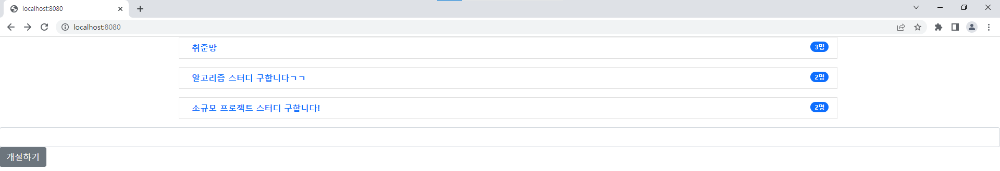
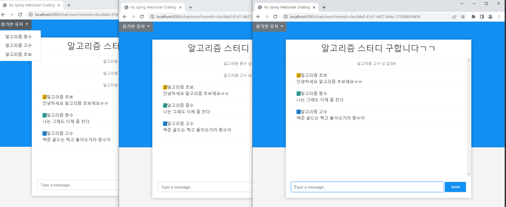
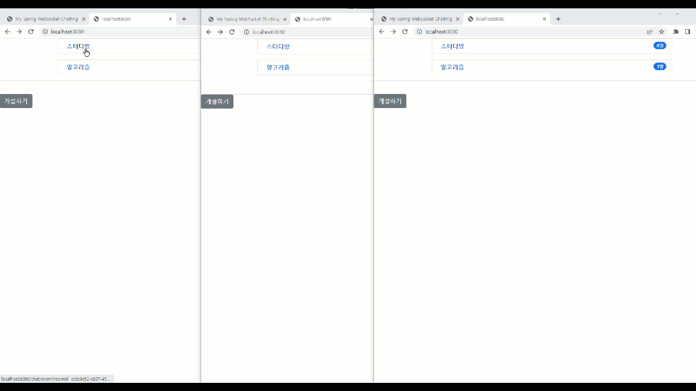

# SpringBoot WebSocket Chatting Project
## 0. Spring Boot 와 WebSocket 을 활용한 채팅 만들기 프로젝트
- 개인적으로 정말정말 해보고 싶었던 실시간 채팅 만들기를 드디어 구현했습니다.
- 사실 이전에 팀프로젝트로 만들었던 채팅이 있긴한데...정말 말도 안될정도로 조잡해서 아쉬웠는데
- 이번에야말로 드디어 제대로된? 실시간 채팅을 구현했습니다!

- 다음 목표는 DB 와 연결, 로그인 후 채팅 기능입니다

## 1. 사용기술
- Java 8
- Spring Boot MVC
- Gradle
- AJAX
- jquery
- WebSocket & SocketJS
- Stomp
- 추후 DB 기술 추가 예정

## 2. 다이어그램

## 3. 공부 목표
- WebSocket 을 활용한 채팅 기능
- Stomp 를 활용한 채팅 고도화 -> pub/sub
- SocketJS 를 활용한 JS 공부
- Spring Boot 활용 및 다양한 어노테이션 사용
- AJAX , jquery, css 공부

## 4. 구현 기능
- 채팅방 생성
- 채팅방 생성 시 중복검사
- 채팅방 닉네임 선택
=> 닉네임 중복 시 임의의 숫자를 더해서 중복 안되도록
- 채팅방 입장 & 퇴장 확인
- 채팅 기능
- 채팅방 유저 리스트 & 유저 숫자 확인

## 5. 추후 추가 기능(목표 기능)
- 채팅방 삭제
- 채팅방 파일 업로드
- 유저 클릭 시 1:1 채팅으로 전환
- 로그인 유저 채팅 && 소셜 로그인유저 채팅

## 6. 구동방법
- 프로젝트를 jar 파일로 빌드
- cmd 에서 java -jar "파일명" 타이핑
- localhost:8080 으로 접속!

## 구동 화면

