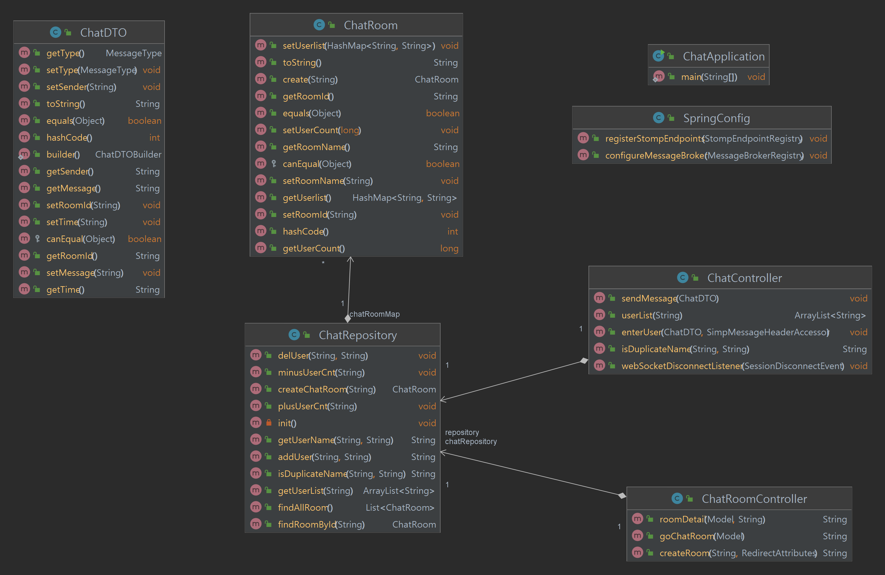
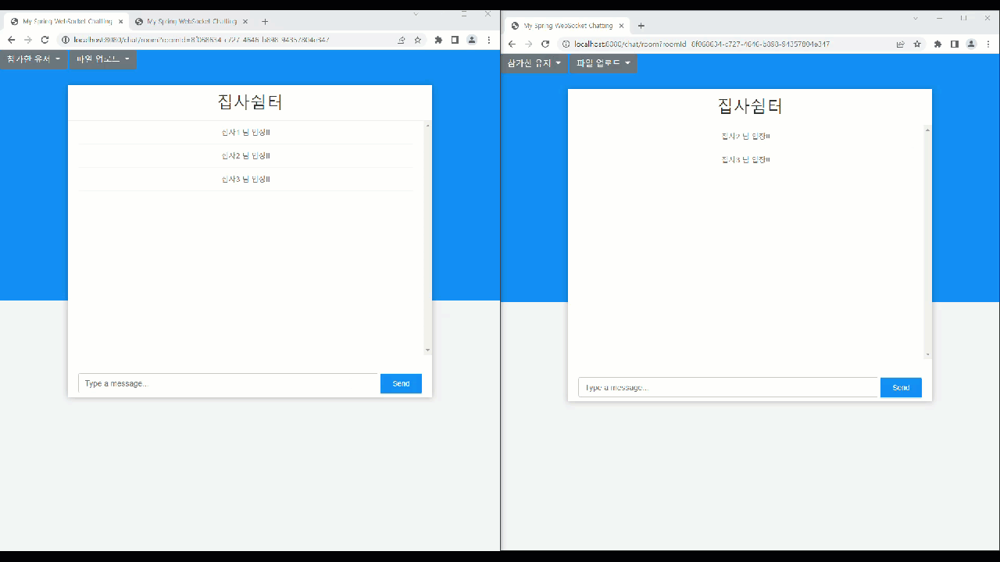

# SpringBoot WebSocket Chatting Project

## 0. Spring Boot 와 WebSocket 을 활용한 채팅 만들기 프로젝트
- SpringBoot 기반 웹 소켓 채팅 및 WebRTC 를 활용한 P2P 화상 채팅
- 상세한 코드 설명은 https://terianp.tistory.com/178 에서 확인 가능합니다.

### 브랜치별 설명
- master : 기본 문자 채팅
- master-Webrtc-jpa : 일반 채팅 + 실시간 화상 채팅, 화면 공유(P2P)

## 1. 사용기술
- Java 8
- Spring Boot MVC
- Gradle
- AJAX
- jquery
- WebSocket & SocketJS
- Stomp
- WebRTC : P2P 실시간 화상 채팅, 화면 공유
- JPA - 추가 예정

## 2. 다이어그램

## 3. 공부 목표
- WebSocket 을 활용한 채팅 기능
- Stomp 를 활용한 채팅 고도화 -> pub/sub
- SocketJS 를 활용한 JS 공부
- Spring Boot 활용 및 다양한 어노테이션 사용
- AJAX , jquery, css 공부
- WebRTC 통신을 위한 SignalingServer 이해 및 구현
- WebRTC 를 활용한 실시간 화상 채팅 및 화면 공유 구현

## 4. 구현 기능
- 채팅방 생성
- 채팅방 생성 시 중복검사
- 채팅방 닉네임 선택 
  - 닉네임 중복 시 임의의 숫자를 더해서 중복 안되도록
- 채팅방 입장 & 퇴장 확인
- 채팅 기능
  - RestAPI 기반 메시지 전송/수신
- 채팅방 유저 리스트 & 유저 숫자 확인
- Amazon S3 기반으로 하는 채팅방 파일 업로드&다운로드 
  - jquery, ajax 활용
- 채팅방 암호화 - 09.12 완료
- 채팅방 삭제
  - 채팅방 삭제 시 해당 채팅방 안에 있는 파일들도 S3 에서 함께 삭제
- 채팅방 유저 인원 설정
  - 인원 제한 시 제한 된 인원만 채팅 참여 가능
- 소셜 로그인유저 채팅
  - 네이버와 카카오 로그인 완료 단 DB 저장 X
- WebRTC 화상 채팅 
  - P2P 기반 음성&영상 채팅, 화면 공유 기능
  - 양방향 화면 공유 기능
- Kubernetes 에 서비스 배포

## 5. 추후 추가 기능(목표 기능)
- 일반 로그인 유저 회원가입 및 채팅(최우선)
- 채팅방 리스트 ajax 형식으로 받기
- 채팅방명, 패스워드 변경
- 유저 클릭 시 1:1 채팅으로 전환
- Redis OR RabbitMQ OR Kafka 3가지 중 하나를 선택해서 메시지 큐 구현
- 채팅을 이용한 간단한 게임 구현 -> 끝말잇기, 초성게임?
- webRTC UI 수정
- Kurento 를 활용한 N:M 채팅 기능
- 음성 인식 후 문자로 변환 및 변환된 문자를 읽어주는 기능

## 6. 구동방법
- 프로젝트를 jar 파일로 빌드
- cmd 에서 java -jar "파일명" 타이핑
- https://localhost:8443 으로 접속!

## 구동 화면

## Reference
https://github.com/Benkoff/WebRTC-SS

https://github.com/codejs-kr/webrtc-lab